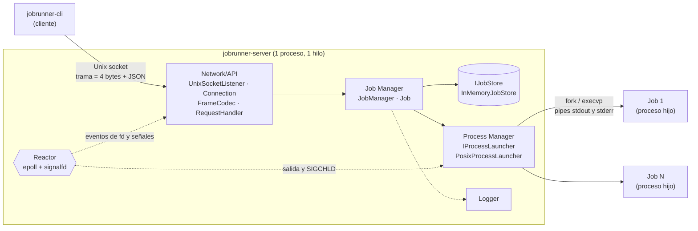
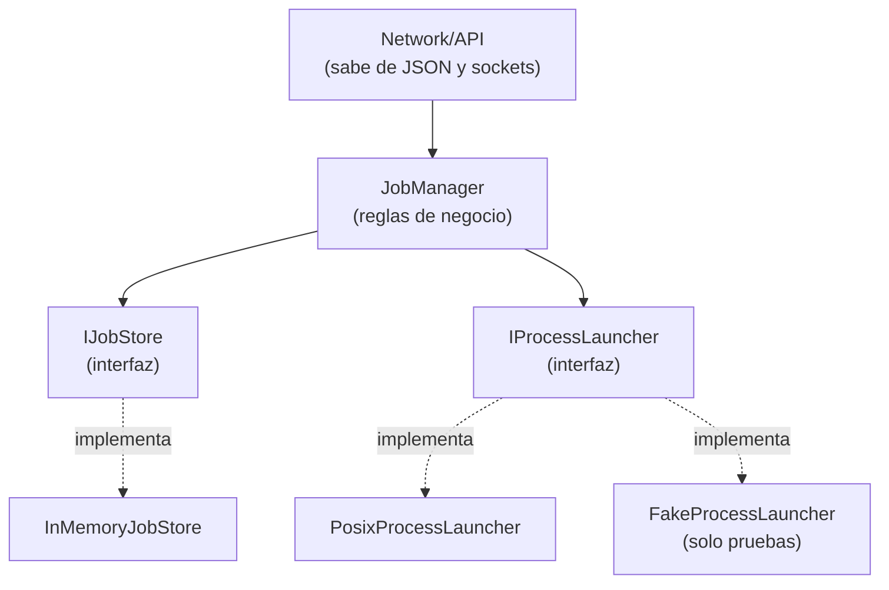
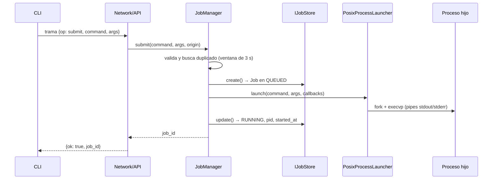
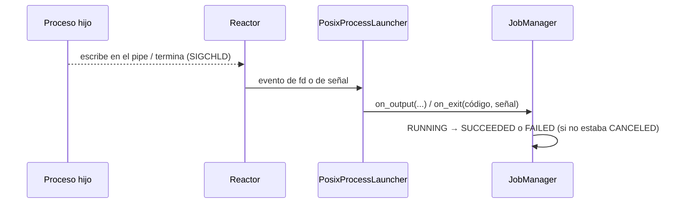

# Arquitectura de JobRunner (J.U.A.N.)

> **Alcance:** describe la arquitectura **implementada en el Avance 1** (núcleo local) y señala lo que aún no existe.
> **Decisiones de origen:** [ADR-001](../decisions/ADR-001-Lenguaje_y_herramientas.md) (herramientas), [ADR-002](../decisions/ADR-002-Arquitectura.md) (arquitectura) y [ADR-003](../decisions/ADR-003-Concurrencia.md) (concurrencia). Este documento no las reemplaza: resume cómo quedaron en el código.
> **Documentos relacionados:** [Modelo de estados](modelo-de-estados.md).

## 1. Visión general

JobRunner es un sistema **cliente-servidor**. El servidor es un **monolito modular** de un solo proceso y un solo hilo, que atiende solicitudes con un event loop `epoll`. Cada Job se ejecuta como un **proceso hijo independiente**, no dentro del servidor.



Dos ideas guían el diseño:

- **El cliente no ejecuta nada.** Solo envía solicitudes y muestra respuestas; el servidor sigue funcionando aunque el cliente se desconecte.
- **El dominio no conoce la infraestructura.** `JobManager` no sabe de JSON ni de sockets, y accede al almacenamiento y a los procesos solo mediante interfaces.

## 2. Módulos

| Módulo (ADR-002) | Clases | Ubicación | Responsabilidad |
|---|---|---|---|
| **Network/API** | `UnixSocketListener`, `Connection`, `FrameCodec`, `RequestHandler` | `src/network/`, `src/protocol/`, `src/server/request_handler.*` | Acepta clientes, arma y valida tramas, traduce JSON ↔ llamadas al dominio y responde. |
| **Event loop** | `Reactor` | `src/io/` | Único bucle del servidor: `epoll` para sockets y pipes, `signalfd` para `SIGCHLD`, `SIGINT` y `SIGTERM`. |
| **Job Manager** | `JobManager`, `Job` | `src/domain/` | Reglas de negocio: validación, detección de duplicados, estados, cancelación. |
| **Persistence** | `IJobStore`, `InMemoryJobStore` | `src/domain/` | Guarda los Jobs. Hoy solo en memoria. |
| **Process Manager** | `IProcessLauncher`, `PosixProcessLauncher` | `src/process/` | `fork`/`execvp`, captura separada de stdout y stderr, señales al grupo de procesos, detección de la salida del hijo. |
| **Logging** | `Logger` | `src/common/` | Bitácora con marca de tiempo e ID de Job. |
| **Cliente** | `main.cpp` + `FrameCodec` | `src/client/` | CLI: arma la solicitud, la envía y muestra la respuesta. |

El punto de entrada del servidor (`src/server/main.cpp`) construye los objetos, los conecta y entrega el control al `Reactor`.

## 3. Dependencias y límites entre capas



- **Solo `RequestHandler` conoce el esquema JSON.** El dominio trabaja con tipos de C++.
- **`JobManager` depende de abstracciones** (`IJobStore`, `IProcessLauncher`). Se puede sustituir el almacenamiento (por ejemplo, por uno en disco) o el lanzador sin tocar las reglas de negocio.
- **Las pruebas unitarias usan `FakeProcessLauncher`** (`tests/fakes/`), que no hace `fork`: permite simular salidas, códigos y señales de forma determinista.

## 4. Protocolo cliente-servidor

- **Transporte:** Unix socket local (por defecto `/tmp/jobrunner.sock`). El servidor obtiene el origen del cliente con `SO_PEERCRED` (`"pid:N"`).
- **Trama:** prefijo de **4 bytes big-endian** con la longitud, seguido de un JSON UTF-8. Tamaño máximo **1 MiB**; una trama mayor se rechaza.
- **Solicitudes** (campo `op`):

| `op` | Campos | Respuesta |
|---|---|---|
| `submit` | comando y argumentos | `ok`, `job_id`, `was_duplicate` |
| `status` | `id` | `ok`, `job` (id, comando, args, estado, `exit_code`, stdout, stderr) |
| `list` | `state` (opcional) | `ok`, `jobs` |
| `cancel` | `id` | `ok` |

- **Errores:** toda solicitud inválida (JSON mal formado, falta `op`, comando vacío, id desconocido) devuelve `{"ok": false, "error": "..."}` y el servidor sigue operando.

## 5. Flujos principales

### 5.1 Envío de un Job



### 5.2 Terminación de un Job



### 5.3 Cancelación

`cancel` envía `SIGTERM` al **grupo de procesos** del Job y lo marca `CANCELED` de inmediato. Si el proceso termina después, `on_child_exit` ignora el evento y el estado no cambia. Cancelar un Job ya terminado es un éxito sin efecto (idempotente). Detalle de transiciones en el [modelo de estados](modelo-de-estados.md).

## 6. Modelo de concurrencia

- **Un solo hilo.** El `Reactor` atiende sockets, pipes y señales en el mismo bucle. Las estructuras compartidas (`JobManager`, `IJobStore`, ventana de duplicados) no necesitan *locks* porque nunca se acceden desde dos hilos.
- **Una consecuencia directa:** un callback lento bloquea la atención de todos los clientes, así que ninguna operación del servidor debe bloquear.
- **Un proceso por Job.** El aislamiento de los Jobs lo da el sistema operativo. En el hijo se restablece la máscara de señales antes de `exec` y se crea un grupo de procesos propio (`setpgid`) para poder cancelarlo completo.
- **Cierre ordenado.** `SIGINT`/`SIGTERM` llegan por `signalfd`: el servidor deja de aceptar clientes y sale del bucle.

Justificación y alternativas descartadas: ver [ADR-003](../decisions/ADR-003-Concurrencia.md).

## 7. Estado de implementación

| Elemento | Estado | Nota |
|---|---|---|
| Network/API, `Reactor`, `JobManager`, Process Manager, Logging | Implementado | Avance 1, solo local |
| Persistencia | Parcial | Solo en memoria; el historial se pierde al reiniciar |
| Cola y límite de concurrencia (Queue Manager) | **Pendiente** | Hoy cada `submit` lanza el proceso de inmediato; `QUEUED` no es observable |
| Configuración | **Pendiente** | Solo se recibe la ruta del socket |
| Recuperación tras reinicio | **Pendiente** | No existe |
| Acceso remoto (LAN/VPN) y control de acceso | **Pendiente** | El transporte actual es un Unix socket local |
| Escalamiento de la cancelación (`SIGKILL`) | **Pendiente** | Solo `SIGTERM` |
| Cierre sin procesos huérfanos | **Pendiente** | Al apagar el servidor no se terminan los Jobs en ejecución |

Mientras estos elementos estén pendientes, los requisitos que dependen de ellos no pueden considerarse cumplidos (ver tabla de requisitos en ADR-002).

## 8. Estructura del código

```text
src/
├── client/      Cliente CLI (jobrunner-cli)
├── server/      Punto de entrada y RequestHandler
├── domain/      Job, JobManager, IJobStore, InMemoryJobStore
├── process/     IProcessLauncher, PosixProcessLauncher
├── io/          Reactor (epoll + signalfd)
├── network/     UnixSocketListener, Connection
├── protocol/    FrameCodec
└── common/      Logger
tests/           Pruebas Catch2 y dobles de prueba (fakes)
```

## 9. Evolución prevista

Las siguientes decisiones están por documentarse en ADR posteriores: protocolo y transporte remoto, persistencia y recuperación, cancelación (escalamiento), saturación de la cola y seguridad. Cualquier separación de módulos en procesos distintos requiere un Change Request (ADR-002).
