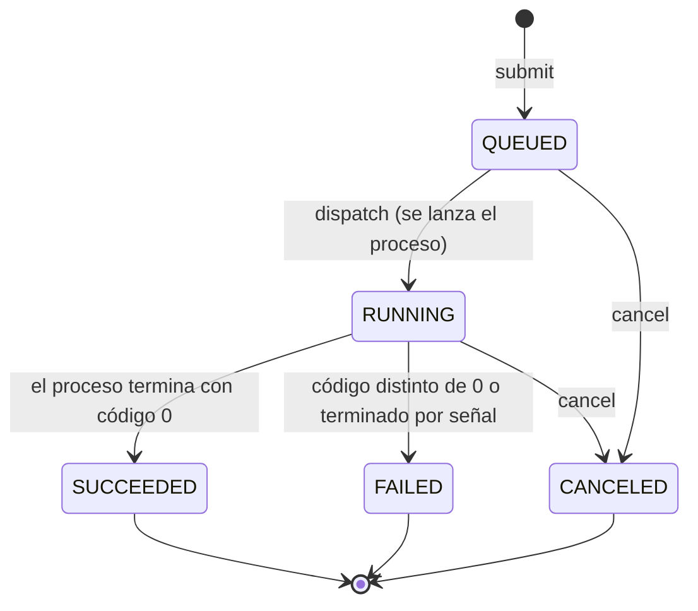

# Modelo preliminar de estados del Job

> **Alcance:** Avance 1 (núcleo local). Describe lo que implementa el código en `src/domain/job.hpp`, `src/domain/job.cpp` y `src/domain/job_manager.cpp`. Lo que aún no existe se marca como **Pendiente**.
> **Requisitos relacionados:** RF-06, RF-07, RF-10, RF-26, RNF-27.

## 1. Estados

| Estado | Significado | Tipo |
|---|---|---|
| `QUEUED` | El Job fue aceptado y registrado, y aún no tiene un proceso asociado. | Inicial |
| `RUNNING` | El Job tiene un proceso hijo en ejecución (se guarda su PID). | Activo |
| `SUCCEEDED` | El proceso terminó con código de salida 0 y sin señal. | Terminal |
| `FAILED` | El proceso terminó con código distinto de 0 o por una señal. | Terminal |
| `CANCELED` | Se solicitó la cancelación del Job. | Terminal |

## 2. Diagrama de transiciones

## 3. Transiciones válidas

La función `is_valid_transition()` (`job.cpp`) es la única fuente de verdad. Cualquier otra combinación lanza `std::logic_error` desde `Job::transition_to()`.

| Desde | Hacia | Quién la dispara | Dónde en el código |
|---|---|---|---|
| (nuevo) | `QUEUED` | `submit` | `InMemoryJobStore::create` |
| `QUEUED` | `RUNNING` | `JobManager::dispatch` tras lanzar el proceso | `job_manager.cpp` (`dispatch`) |
| `QUEUED` | `CANCELED` | `JobManager::cancel` | `job_manager.cpp` (`cancel`) |
| `RUNNING` | `SUCCEEDED` | Terminación del proceso con código 0 y sin señal | `job_manager.cpp` (`on_child_exit`) |
| `RUNNING` | `FAILED` | Terminación con código distinto de 0 o por señal | `job_manager.cpp` (`on_child_exit`) |
| `RUNNING` | `CANCELED` | `JobManager::cancel` (envía `SIGTERM` al grupo de procesos) | `job_manager.cpp` (`cancel`) |

## 4. Reglas

1. **Los estados terminales no tienen salida.** `SUCCEEDED`, `FAILED` y `CANCELED` no admiten ninguna transición, por lo que no son posibles las regresiones (RNF-27).
2. **La cancelación es idempotente.** Cancelar un Job que ya está en un estado terminal devuelve éxito y no cambia nada. Cancelar un Job desconocido devuelve error (RF-10, RF-26).
3. **Un Job cancelado conserva `CANCELED`.** Si el proceso termina después de la cancelación, `on_child_exit` ignora el evento y no cambia el estado.
4. **Un solo hilo serializa los cambios.** El estado solo cambia dentro del event loop (ADR-003), por lo que dos cancelaciones simultáneas sobre el mismo Job producen un resultado coherente.

## 5. Datos que se registran con el estado (RF-07)

| Campo | Se llena cuando |
|---|---|
| `received_at` | Se crea el Job. |
| `started_at` | Pasa a `RUNNING`. |
| `finished_at` | Pasa a un estado terminal. |
| `pid` | Pasa a `RUNNING`. |
| `exit_code` | El proceso termina por sí mismo (`SUCCEEDED` o `FAILED`). |
| `exit_signal` | El proceso termina por una señal. |

## 6. Comportamiento actual y limitaciones

- **`QUEUED` no es observable todavía.** Hoy `submit` crea el Job y llama a `dispatch` de inmediato en la misma solicitud, por lo que pasa a `RUNNING` antes de que un cliente pueda consultarlo. No hay límite de concurrencia ni cola. **Pendiente (Hito 2).**
- **Los tiempos no salen en la respuesta.** `received_at`, `started_at` y `finished_at` se guardan, pero `status` y `list` aún no los devuelven. **Pendiente.**
- **Un Job cancelado en ejecución no guarda `exit_code` ni `exit_signal`.** Se marca `CANCELED` al instante y el evento de salida del proceso se ignora.
- **Un comando inexistente termina en `FAILED` con código 127.** El Job se acepta y el error aparece en el `exec` del proceso hijo. Es una decisión de diseño, no un error del servidor.
- **No existe `QUEUED → FAILED`.** Si falla la creación del proceso (`fork` o `pipe`), hoy el Job no se marca como `FAILED` (RF-29). Al implementarlo, hay que agregar esa transición a `is_valid_transition`. **Pendiente (Hito 2).**
- **Sin recuperación tras reinicio.** El estado vive en memoria. Cuando exista persistencia, un Job que estaba en `RUNNING` al caer el servidor no deberá reportarse como `RUNNING` (RNF-10, RNF-31). **Pendiente (Hito 2).**

## 7. Verificación

- **TC-003 (Estados y tiempos):** cubre RF-06 y RF-07. Debe incluir una prueba unitaria de todas las combinaciones de `is_valid_transition`.
- **TC-005 (Cancelación):** debe comprobar que el estado es `CANCELED` y que el proceso realmente terminó.
- **TC-017 (Cancelaciones concurrentes):** cubre RF-26 y RNF-27.

Estos casos aún no tienen evidencia ejecutada.
