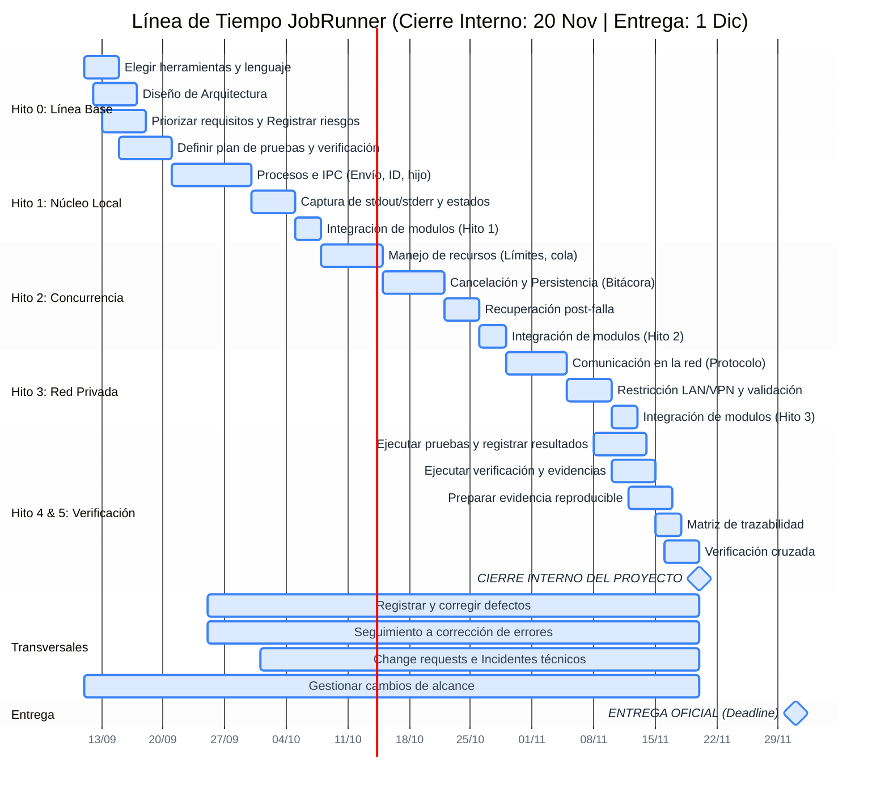

```mermaid
%%{init: {"theme": "base", "themeVariables": {"ganttTitleColor": "#1f2937", "textColor": "#374151", "taskBkgColor": "#dbeafe", "taskBorderColor": "#3b82f6", "taskTextDarkColor": "#1e3a8a", "taskTextLightColor": "#1e3a8a", "taskTextOutsideColor": "#1f2937", "sectionBkgColor": "#f9fafb", "sectionBkgColor2": "#f3f4f6", "todayMarker": "rgba(239, 68, 68, 0.4)"}}}%%
gantt
    title Línea de Tiempo JobRunner (Cierre Interno: 20 Nov | Entrega: 1 Dic)
    dateFormat  YYYY-MM-DD
    axisFormat  %d/%m

    section Hito 0: Línea Base
    Elegir herramientas y lenguaje          :h0_1, 2026-09-11, 4d
    Diseño de Arquitectura                  :h0_2, 2026-09-12, 5d
    Priorizar requisitos y Registrar riesgos:h0_3, 2026-09-13, 5d
    Definir plan de pruebas y verificación  :h0_4, 2026-09-15, 6d

    section Hito 1: Núcleo Local
    Procesos e IPC (Envío, ID, hijo)        :h1_1, 2026-09-21, 9d
    Captura de stdout/stderr y estados      :h1_2, after h1_1, 5d
    Integración de modulos (Hito 1)         :h1_3, after h1_2, 3d

    section Hito 2: Concurrencia
    Manejo de recursos (Límites, cola)      :h2_1, 2026-10-08, 7d
    Cancelación y Persistencia (Bitácora)   :h2_2, after h2_1, 7d
    Recuperación post-falla                 :h2_3, after h2_2, 4d
    Integración de modulos (Hito 2)         :h2_4, after h2_3, 3d

    section Hito 3: Red Privada
    Comunicación en la red (Protocolo)      :h3_1, 2026-10-29, 7d
    Restricción LAN/VPN y validación        :h3_2, after h3_1, 5d
    Integración de modulos (Hito 3)         :h3_3, after h3_2, 3d

    section Hito 4 & 5: Verificación
    Ejecutar pruebas y registrar resultados :h4_1, 2026-11-08, 6d
    Ejecutar verificación y evidencias      :h4_2, 2026-11-10, 5d
    Preparar evidencia reproducible         :h4_3, 2026-11-12, 5d
    Matriz de trazabilidad                  :h4_4, 2026-11-15, 3d
    Verificación cruzada                    :h4_5, 2026-11-16, 4d
    CIERRE INTERNO DEL PROYECTO             :milestone, 2026-11-20, 0d

    section Transversales
    Registrar y corregir defectos           :trans1, 2026-09-25, 56d
    Seguimiento a corrección de errores     :trans2, 2026-09-25, 56d
    Change requests e Incidentes técnicos   :trans3, 2026-10-01, 50d
    Gestionar cambios de alcance            :trans4, 2026-09-11, 70d
    
    section Entrega
    ENTREGA OFICIAL (Deadline)              :milestone, 2026-12-01, 0d
```